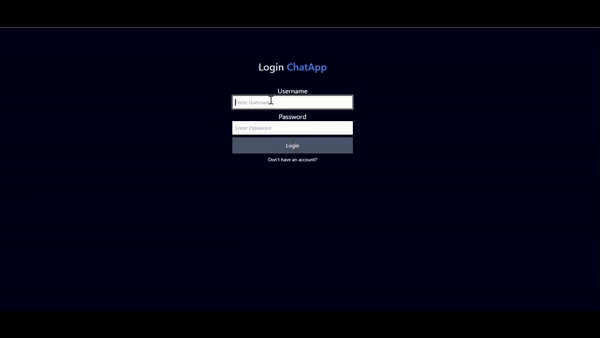

# React + TypeScript + Vite

First, run the development server:

```bash
npm run server
# or
yarn run server
# or
pnpm run server
# or
bun run server
```

Client:

```bash
npm run dev
# or
yarn dev
# or
pnpm dev
# or
bun dev
```
